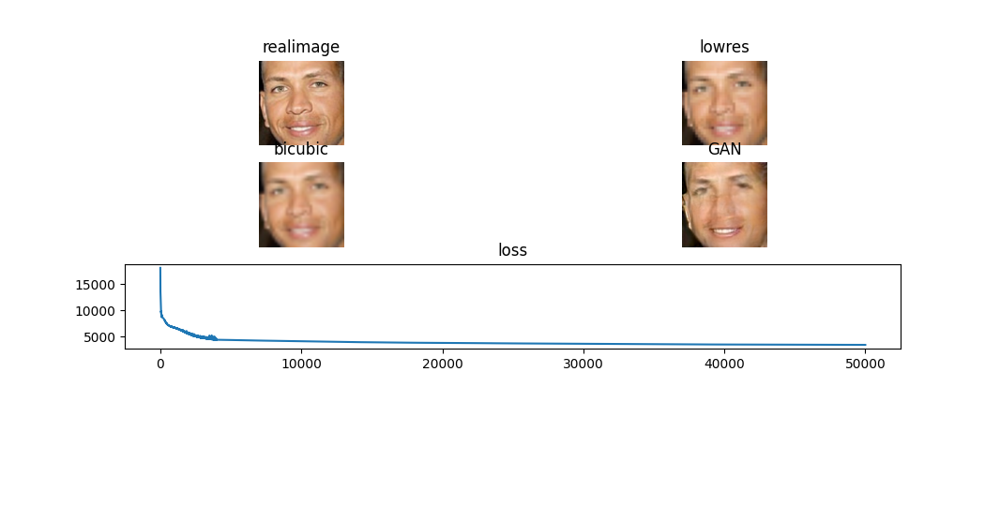

# Image-Restoration_using-GANs

## Target
The target of this project is to restore the image from low to high resolution and is based on [this](https://arxiv.org/pdf/2005.14036.pdf)
## Enviroment
- Python == 3.8.16
- Install libraries: `pip3 install -r requirements.txt`
- conda == 22.9.0

## Preparetion
1. Download model from [here](https://tfhub.dev/google/progan-128/1) ,unzip and place it in `output/facemodel` folder
2. Place your test images in `images/` folder

## Usage
1. If image comes from module space run `python facerestoraion.py -LR <Low Resolution>`
2. If image comes from your disc with resolution greater than 128, you should choose the low resolution that should be a power of two (32,64) and run `python facerestoraion.py -if 0 -LR <Low Resolution> -ip `"images/<image_name>"` -ns 50000`
3. If image comes from your disc with resolution smaller than 128 run `python facerestoraion.py -if 0 -resi 1  -ip `"images/<image_name>"` -ns 50000`
- Note: 2 & 3 take lot of time

## Results
- Target image is created from the generator

In this picture we see the image that we want to restore ("lowres"), the target image ("real image") the result if we apply      bicubic interpolation and the result from the method based on GANs

In this picture it looks how method is searching for the target image

- Target image is a real world image

## References
- Code is based on [this](https://colab.research.google.com/github/tensorflow/hub/blob/master/examples/colab/tf_hub_generative_image_module.ipynb#scrollTo=KUu4vOt5zI9d)
- Method is based on [this](https://arxiv.org/pdf/2005.14036.pdf)
